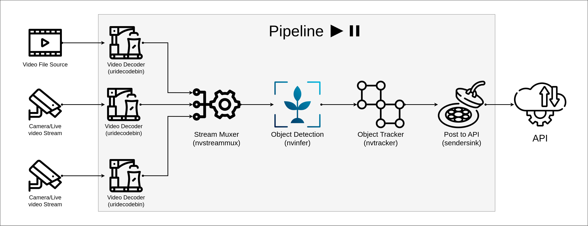

# DeepStream Object Detection and Tracking

This repository is a simple project to demonstrate how to implement a pipeline for object detection and tracking using NVidia DeepStream.
It also contains a simple implementation of a custom DeepStream plugin using python.

### Requirements:
 - DeepStream SDK = 6.0
 - Python >= 3.6
 - Python-Gst >= 1.14.0
 - pyDS


# 1. System Design
This system is designed to do object detection and tracking on video stream/files and send results to a web API using post request.

System design illustrated below:



</br>

# 2. Installation
Before starting to install I highly recommend using Docker

## <b>Docker</b>
To build
> docker build --gpus all -t deepstream_tracking_sample:0.1 .

To run
> docker run --gpus all --network host -i deepstream_tracking_sample:0.1

## <b>Ubuntu</b>
There are three steps to install dependencies
### 1. DeepStream SDK
First you need to install <a href="https://developer.nvidia.com/deepstream-sdk"> DeepStream SDK</a>, I assume you've already installed DeepStream SDK

The following dependencies need to be met:
### 2. Base dependencies
Ubunutu - 18.04 [using python-3.6]:
```
apt install -y git python-dev python3 python3-pip python3.6-dev python3.8-dev cmake g++ build-essential\
    libglib2.0-dev libglib2.0-dev-bin python-gi-dev libtool m4 autoconf automake
```
Ubuntu - 20.04 [using python-3.8]:
```
apt install python3-gi python3-dev python3-gst-1.0 python-gi-dev git python-dev \
    python3 python3-pip python3.8-dev cmake g++ build-essential libglib2.0-dev \
    libglib2.0-dev-bin python-gi-dev libtool m4 autoconf automake
```
### 3. Build python bindings
Gst-python:

```
git clone https://github.com/GStreamer/gst-python.git
cd gst-python
./autogen.sh
make
make install
```
After building and installing gst-python you need to set GST_PLUGIN_PATH variable to point to plugins, for this project plugins are located at the <a href="./plugins"> plugins</a> folder
```
export GST_PLUGIN_PATH=$GST_PLUGIN_PATH:<project-path>/plugins
```

Pybind11:
```
git clone https://github.com/pybind/pybind11.git
cd pybind11
python3 setup.py install
```

PyDS:
```
git clone https://github.com/NVIDIA-AI-IOT/deepstream_python_apps/
cd deepstream_python_apps/bindings/
mkdir build && cd build
```
Ubuntu - 18.04 [using python-3.6]:
```
cmake ..
make
pip3 install pyds-1.1.0-py3-none-linux_x86_64.whl
```
Ubuntu - 20.04 [using python-3.8]:
```
cmake .. -DPYTHON_MAJOR_VERSION=3 -DPYTHON_MINOR_VERSION=8
make
pip3 install pyds-1.1.0-py3-none-linux_x86_64.whl
```

Python requirements:
```
pip3 install -r requirements.txt
```


# 3. Configuration
For the configuration there are some config files that are located in <a href="./configs">configs folder</a>
### 3.1 Main Config
In this config file you need to provide project's main configs such as video stream uris, object detector's config, object tracker's config. <br> Example: <a href="./configs/main_config.yml">main_config.yml</a>
### 3.2 Object detector
Config file for nvinfer plugin <br>
Example: <a href="./configs/pgie_config.txt">pgie_config.txt</a>
### 3.3 Object Tracker
Config file for nvtracker plugin <br>
Example: <a href="./configs/tracker_config.txt">tracker_config.txt</a>


# 4. Run
To run the project after installing all the requirements just simply run:
```
python3 pipeline configs/main_config.yml
```
After running the command above, the pipeline starts to build and play, by detecting any object sendersink would send a post request to API, for testing results there is a simple Flask Rest-API that receives post request from sendersink.<br>
To run the test API run the following commands:
```
pip3 install flask, flask-cors
python3 test/receiver_app.py
```


## References:
- https://github.com/NVIDIA-AI-IOT/deepstream_python_apps
- https://github.com/GStreamer/gst-python

